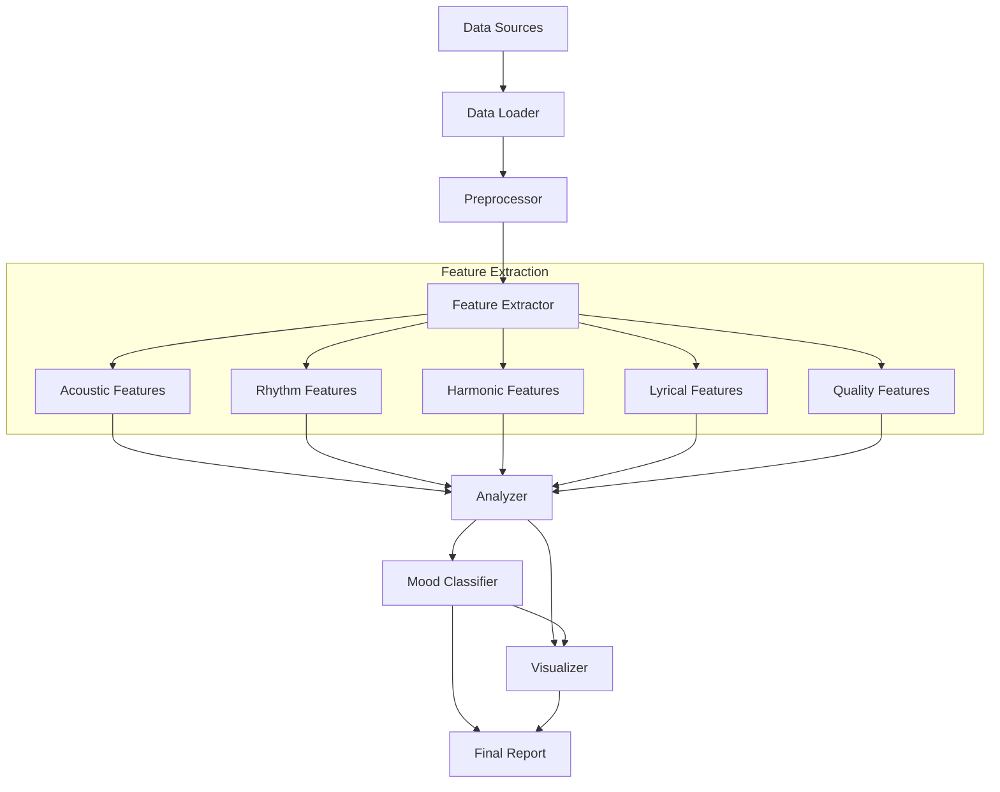

# SAPPHIRE Architecture

## System Overview

SAPPHIRE (Semantic and Acoustic Perceptual Holistic Integration REtrieval) is a modular music analysis pipeline designed to bridge the gap between low-level audio features and high-level human perception. It integrates multi-modal data sources (audio, lyrics, metadata) to provide a comprehensive understanding of music tracks.

The system is built as a pipeline with distinct stages for data loading, preprocessing, feature extraction, analysis, classification, and visualization.

## High-Level Architecture

## Core Components

### 1. Data Loader (`pipeline/data_loader.py`)
Responsible for discovering and loading data from various supported datasets. It normalizes the input into a standard `MusicTrack` object.

- **Supported Datasets**: MIREX-like mood, CSD, JAM-ALT, Vietnamese, 100M.
- **Key Classes**: `DataLoader`, `MusicTrack`.

### 2. Preprocessor (`pipeline/preprocessor.py`)
Ensures data quality and consistency before feature extraction.

- **Audio**: Normalization, resampling, silence removal.
- **Lyrics**: Language detection, cleaning.
- **Quality Control**: SNR filtering, completeness checks.

### 3. Feature Extractor (`pipeline/feature_extractor.py`)
The core engine that extracts over 100 features across multiple modalities.

- **Acoustic**: MFCCs, spectral centroid, rolloff, bandwidth.
- **Rhythm**: Tempo, beat tracking, onset density.
- **Harmony**: Chroma features, key estimation.
- **Lyrics**: Sentiment (VADER), semantic embeddings (Sentence Transformers), readability.
- **Quality**: SNR, dynamic range.

### 4. Analyzer (`pipeline/analyzer.py`)
Performs statistical analysis and dimensionality reduction on the extracted features.

- **Clustering**: K-means, DBSCAN to find natural groupings.
- **Dimensionality Reduction**: PCA, t-SNE for visualization.
- **Cross-Modal Analysis**: Correlating acoustic and lyrical features to find the "perceptual gap".

### 5. Mood Classifier (`pipeline/mood_classifier.py`)
Machine learning component for predicting mood categories.

- **Models**: Random Forest, SVM, Neural Networks.
- **Training**: Cross-validation, grid search for hyperparameters.
- **Inference**: Predicting mood for new tracks.

### 6. Visualizer (`pipeline/visualizer.py`)
Generates plots and charts to communicate results.

- **Types**: Feature distributions, correlation matrices, confusion matrices, dimensionality reduction plots.

### 7. Pipeline Orchestrator (`pipeline/pipeline.py`)
Manages the flow of data between components and handles configuration.

## Data Flow

1. **Input**: Raw audio files and lyrics text files.
2. **Standardization**: Converted to `MusicTrack` objects.
3. **Features**: Transformed into a pandas DataFrame (`FeatureContainer`).
4. **Analysis**: Aggregated statistics and clustering results.
5. **Output**: JSON reports, CSV feature files, trained models, and visualization images.

## Technologies

- **Language**: Python 3.8+
- **Audio Processing**: Librosa, PyLoudNorm
- **Machine Learning**: Scikit-learn
- **NLP**: NLTK, Sentence Transformers
- **Data Handling**: Pandas, NumPy
- **Visualization**: Matplotlib, Seaborn, Plotly
